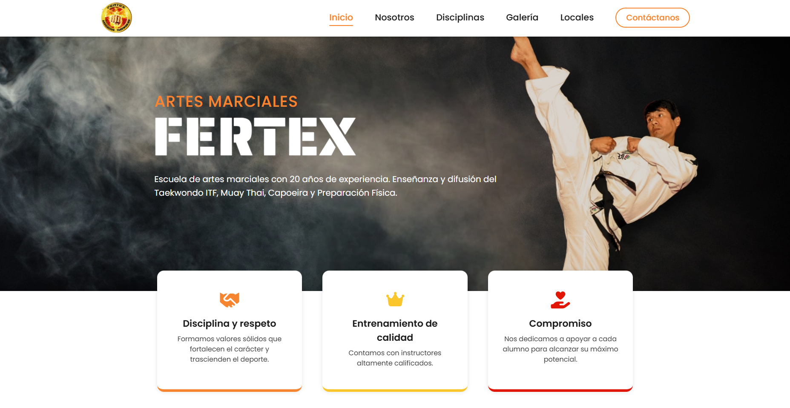

# FERTEX – Sitio Web Oficial  


Landing page moderna y responsiva para una academia de artes marciales con más de 20 años de trayectoria.  
Desarrollada con **React + Vite**, enfocada en rendimiento, diseño mobile-first y experiencia de usuario.
## Vista previa del sitio 

🌐 **Sitio en producción:** https://taekwondofertex.com/  
📦 **Repositorio:** https://github.com/Novita17x/fertex.git

## Tecnologías utilizadas

| Tecnología | Propósito |
|------------|-----------|
| **React 18** | Biblioteca principal para componentes UI |
| **Vite** | Build tool moderno para desarrollo rápido |
| **Tailwind CSS** | Framework utility-first para estilos |
| **Intersection Observer API** | Animaciones progresivas según scroll |


## Objetivo del proyecto
Este proyecto surge de la necesidad de digitalizar la presencia de la academia FERTEX, permitiendo que familias y potenciales alumnos encuentren información clara, accesible y disponible 24/7.
El resultado es una landing page rápida, moderna y completamente optimizada para mejorar la visibilidad y el proceso de captación de nuevos alumnos.
## Características principales
### Diseño y experiencia de usuario
- Diseño mobile-first desde la estructura base.  
- Secciones limpias y enfocadas en la conversión.  
- Microinteracciones suaves con Intersection Observer.
### Performance y optimización
- Preload de fuentes e imágenes críticas.  
- Lazy loading para galería y recursos pesados.  
- Animaciones progresivas según scroll.  
- Estructura optimizada gracias al entorno Vite.
### Contenido informativo
- **Inicio:** Presentación institucional.  
- **Nosotros:** Historia y valores.  
- **Disciplinas:** Taekwondo ITF, Muay Thai y Capoeira.
- **Instructores:** Tarjetas de los instructores.  
- **Galería:** Fotos reales de clases y eventos.  
- **Locales:** Información de sedes con mapa integrado.  
## Instalación y ejecución del proyecto
### Clona el repositorio:
```bash
git clone https://github.com/Novita17x/fertex.git
```

### Ingresa a la carpeta:
```bash
cd fertex
```

### Instala dependencias:
```bash
npm install
```

### Ejecuta el entorno de desarrollo:
```bash
npm run dev
```
